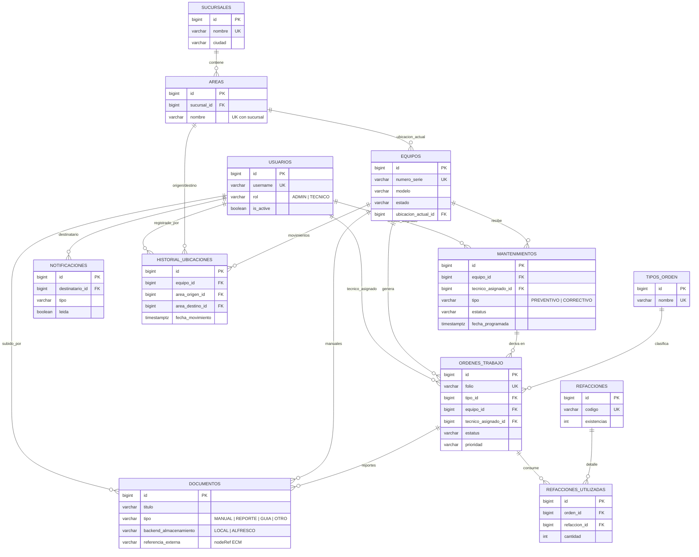

# Modelo Entidad-Relación — Plataforma de Mantenimiento Kyocera

> Fuente de verdad: modelos Django en `back/apps/*/models.py`. Las migraciones
> generan este esquema en PostgreSQL. `BD/schema.sql` es el DDL de referencia.

## Diagrama (Mermaid)

## Decisiones de diseño

| Decisión | Justificación |
|---|---|
| `BIGINT IDENTITY` en todas las PK | Crecimiento a millones de registros sin migración de tipo. |
| `ON DELETE RESTRICT/PROTECT` en FKs de negocio | Nunca se pierde trazabilidad de equipos, técnicos ni catálogos. |
| Historial de ubicaciones en tabla propia | El equipo guarda solo la ubicación actual; la bitácora crece sin inflar `equipos`. |
| Índices compuestos `(tecnico, fecha)` y `(tecnico, estatus)` | Son las consultas dominantes: calendario por técnico y "mis órdenes". |
| `TIMESTAMPTZ` en todos los timestamps | Operación multi-sucursal / multi-zona horaria sin ambigüedad. |
| Documentos = solo metadatos + backend conmutables (`LOCAL`/`ALFRESCO`) | Los PDFs pesados migran al ECM sin cambiar el esquema ni la API. |
| Notificaciones con relación genérica (content_type + object_id) | Una sola tabla notifica mantenimientos, órdenes y eventos futuros. |
| `CHECK` constraints espejo de los `choices` de Django | Integridad garantizada aun si otro sistema escribe directo a la BD. |

## Estrategia de crecimiento

- **Particionado futuro**: `historial_ubicaciones`, `notificaciones` y
  `ordenes_trabajo` son candidatas a particionado por rango de fecha
  (`PARTITION BY RANGE (creado_en)`) cuando superen ~10M de filas.
- **Réplicas de lectura**: el dashboard y los reportes pueden apuntar a una
  réplica; la app ya separa lecturas pesadas (listados paginados) de escrituras.
- **`CONN_MAX_AGE` + statement_timeout** configurados en Django para
  estabilidad bajo carga.
